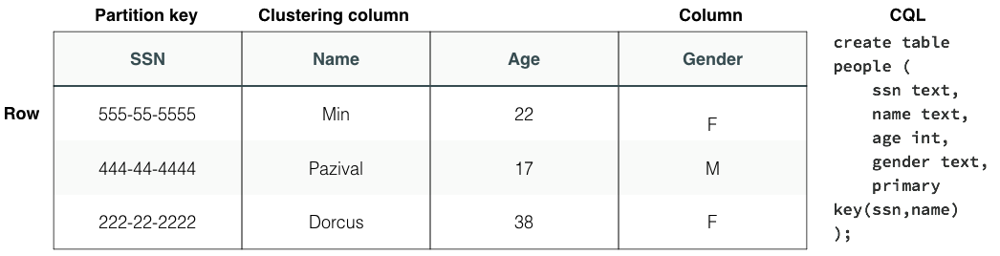

# Prise en main

## Concepts essentiels

Cette étape présente les concepts essentiels de Cassandra.

### Noeud
Un noeud est une instance de Cassandra.

### Ring
Un ring est un cluster Cassandra. La notion de ring provient du fait que **Cassandra**, contrairement à beaucoup d'autres bases NoSQL ne dispose pas d'un mécanisme de noeuds Master/Slave, tous les noeuds sont équivalents.


### Sharding

Pour répartir les données sur le cluster, **Cassandra** s'appuie sur un principe de [**consistent-hashing**](https://en.wikipedia.org/wiki/Consistent_hashing) qui permet d'équilibrer les données en fonction de leur clé sur l'ensemble du ring. Chaque noeud est "responsable" d'un range de key.

### Replication Factor

**Cassandra** s'appuie sur un `replication factor` pour assurer la haute disponibilité et la durabilité des données. Le `replication factor` désigne le nombre total de copies des données nécessaires au fonctionnement nominal du cluster.

### Read/Write consistency

La cohérence de lecture est paramétrable pour chaque opération de lecture ou d'écriture. [Il existe de nombreux niveaux de cohérences](https://docs.datastax.com/en/cassandra/3.0/cassandra/dml/dmlConfigConsistency.html), les principaux sont :

* **ONE** : l'écriture est acquittée lorsqu'**une seule** copie des données est écrite
* **QUORUM** : l'écriture est acquittée lorsqu'**une majorité** de copies des données est écrite
* **ALL** : l'écriture est acquittée lorsque **la totalité** des copies des données est écrite

Les performances d'écriture sont bien évidemment impactées directement par le nombre de copies écrites.

Pour que les opérations d'écriture et de lecture soient cohérentes, veillez à respecter le principe suivant :
```
  Soit W le nombre de réplique écrites
  Soit R le nombre de réplique lues
  Soit RF le Replication Factor
  W + R > RF
```

Par exemple, les configurations suivantes sont cohérentes :
* W:ALL, R:ONE
* W:ONE, R:ALL
* W:QUORUM, R:QUORUM

Les configurations incluant des paramètres **ALL** ne sont pas compatibles avec la haute disponibilité, la configuration cohérente la plus utilisée est **QUORUM**/**QUORUM**.

### Keyspace

Proche du concept de schéma pour une base de données relationnelle, la notion de `keyspace` permet de regrouper un ensemble de `tables`. Le **Replication Factor** est configuré à l'échelle d'un `keyspace`.

### Table

Les `tables` (aussi appelées **Column Families**) sont les entités qui permettent de stocker les données. Les tables contiennent des lignes (**`rows`**). Une `row` est composé d'une clé et d'un ensemble de colonnes.



## CQL : Cassandra Query Language

Le CQL est le langage de requête utilisé pour accéder à Cassandra. La suite de ce workshop se passe dans le shell **Cassandra** que vous avez préalablement installé.

Pour lancer le shell :

```
bin/cqlsh
```

Pour quitter le terminal :

```
quit;
```

### Création d'un keyspace

Nous allons créer le keyspace `imdb` qui dispose d'un **Replication Factor** de 1 :

```
CREATE KEYSPACE IF NOT EXISTS imdb WITH REPLICATION = { 'class' : 'SimpleStrategy', 'replication_factor' : 1 };
```

Pour voir l'ensemble des keyspaces présents dans votre cluster, vous pouvez utiliser la commande suivante :

```
DESCRIBE keyspaces;
```

### Sélection d'un keyspace

Pour sélectionner le keyspace dans lequel vous allez travailler, tapez la commande suivante :
```
USE imdb;
```

### Suppression d'un keyspace

Pour supprimer un keyspace :

```
DROP KEYSPACE imdb;
```

### Création d'une table

Nous allons à présent créer une table `movies` :

```sql
CREATE TABLE imdb.movies (
  title text PRIMARY KEY,
  director text,
  year int,
  rank int,
  rating decimal,
  genres set<text>
  );
```

Les types disponibles sont très proches des types qu'on trouve dans le monde relationnel, malgré tout **Cassandra** propose quelques types bien utiles :

* **list** : liste de valeurs au format ['value1', 'value2', 'value3']
* **set** : set de valeurs au format {'value1', 'value2', 'value3'}
* **map** : map de valeurs au format {'key1':'value1', 'key2':'value2', 'key3':'value3'}
* **tuple** : ensemble de valeurs de type hétérogène au format ('val1', val2, val3)

### Suppression de la table

A tout moment, vous pouvez supprimer la table à l'aide de la commande suivante :

```sql
DROP TABLE imdb.movies ;
```

### Insertion de données
Nous allons à présent insérer des données dans Cassandra :

```sql
INSERT INTO imdb.movies (title, director, year, rank, rating, genres) VALUES ('The Shawshank Redemption', 'Frank Darabont',	1994,	1, 9.2, {'Crime', 'Drama'});
INSERT INTO imdb.movies (title, director, year, rank, rating, genres) VALUES ('The Godfather', 'Francis Ford Coppola', 1972, 2, 9.2, {'Crime', 'Drama'});
INSERT INTO imdb.movies (title, director, year, rank, rating, genres) VALUES ('The Godfather: Part II', 'Francis Ford Coppola', 1974, 3, 9, {'Crime', 'Drama'});
INSERT INTO imdb.movies (title, director, year, rank, rating, genres) VALUES ('Pulp Fiction', 'Quentin Tarantino', 1994, 4, 8.9, {'Crime', 'Drama'});
INSERT INTO imdb.movies (title, director, year, rank, rating, genres) VALUES ('The Good, the Bad and the Ugly', 'Sergio Leone', 1966, 5, 8.9, {'Western'});
INSERT INTO imdb.movies (title, director, year, rank, rating, genres) VALUES ('12 Angry Men', 'Sidney Lumet', 1957, 6, 8.9, {'Crime' ,'Drama'});
INSERT INTO imdb.movies (title, director, year, rank, rating, genres) VALUES ('Schindler''s List', 'Steven Spielberg',	1993,	7, 8.9, {'Biography', 'Drama', 'History'});
```

### Requêtes

Nous allons à présent requêter la base de données :

```sql
SELECT * FROM imdb.movies;
```

Comme en SQL, nous pouvons ajouter des conditions :

```sql
SELECT * FROM imdb.movies WHERE title = '12 Angry Men';
```

Ou effectuer des projections :

```sql
SELECT title, rank FROM imdb.movies;
```

Ou encore utiliser des fonctions d'agrégation :

```sql
SELECT count(*) FROM imdb.movies;
```

### Mise à jour des données

Il est possible d'updater les données de la manière suivante :

```sql
UPDATE imdb.movies SET year = 1993 WHERE title = 'Pulp Fiction';
```

Mise à jour d'un set :
```sql
UPDATE imdb.movies SET genres = genres + {'Polar'} WHERE title = 'Pulp Fiction';
```

### Suppression des données

Vous pouvez supprimer les données de la manière suivante :

```sql
TRUNCATE imdb.movies;
```

Ou avec une condition :

```sql
DELETE from imdb.movies WHERE title = '12 Angry Men';
```


### Pratiquement comme du SQL... ou pas

Essayez les requêtes suivantes :

```sql
SELECT * FROM imdb.movies WHERE year = 1994;
SELECT * FROM imdb.movies WHERE title = '12 Angry Men' and year = 1957;
```

Et constatez les erreurs ! :smile:

Nous ne pouvons ajouter des conditions que sur l'attribut `title` qui fait partie de la clé primaire.

Recommencez en changeant la description de la table `movies` :

```sql
CREATE TABLE imdb.movies (
  title text,
  director text,
  year int,
  rank int,
  rating decimal,
  genres set<text>,
  PRIMARY KEY (year, rank)
  );
```

A présent nous pouvons exécuter les requêtes suivantes :

```sql
SELECT * FROM imdb.movies WHERE year = 1994;
SELECT * FROM imdb.movies WHERE year = 1994 ORDER BY rank DESC;
SELECT * FROM imdb.movies WHERE year = 1994 AND rank = 1;
SELECT * FROM imdb.movies WHERE year = 1994 AND rank <= 3;
```

Cool, on est tirés d'affaire, on peut réexécuter la requête suivante :

```sql
SELECT * FROM imdb.movies WHERE title = '12 Angry Men';
SELECT * FROM imdb.movies WHERE rank = 1;
```

Ah bah non ... :disappointed:

Dans **Cassandra**, vous devez écrire les données de la manière dont vous allez les lire. Il n'est pas rare de trouver ce type de modélisations :
```sql
CREATE TABLE imdb.movies_by_title (
  title text,
  director text,
  year int,
  rank int,
  rating decimal,
  genres set<text>,
  PRIMARY KEY (title)
  );
```

Qu'optenez-vous lorsque vous exécutez la requête suivante ?

```sql
SELECT * FROM imdb.movies_by_title WHERE title = '12 Angry Men';
```

Comment modéliser vos données pour pouvoir servir la requête suivnate ?

```sql
SELECT * FROM imdb.movies WHERE rank = 1;
```

### S'il vous reste un peu de temps ...

D'autres éléments pour débuter avec **Cassandra** :

* Les vues matérialisées http://docs.datastax.com/en/cql/3.3/cql/cql_using/useCreateMV.html
* Les index **Attention !!!!** : http://docs.datastax.com/en/cql/3.3/cql/cql_using/useCreateQueryIndexes.html
* Les données temporaires avec le Time-To-Live (**TTL**) http://docs.datastax.com/en/cql/3.3/cql/cql_using/useTTL.html
